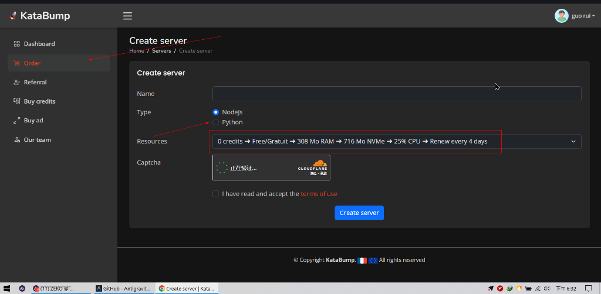
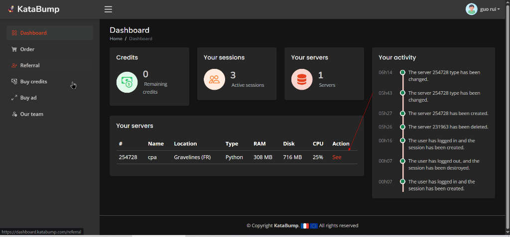
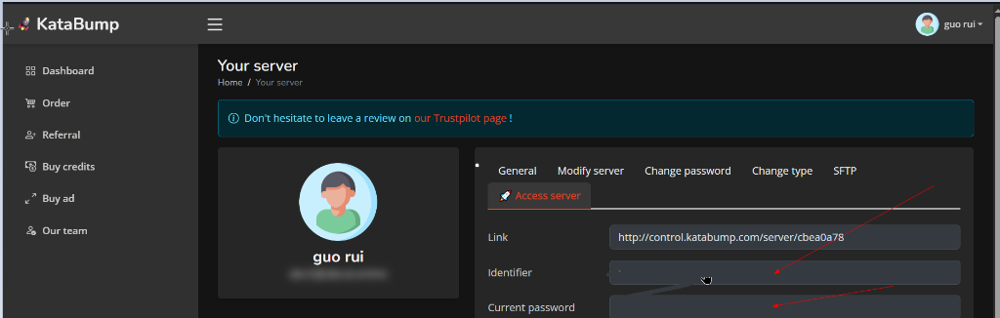
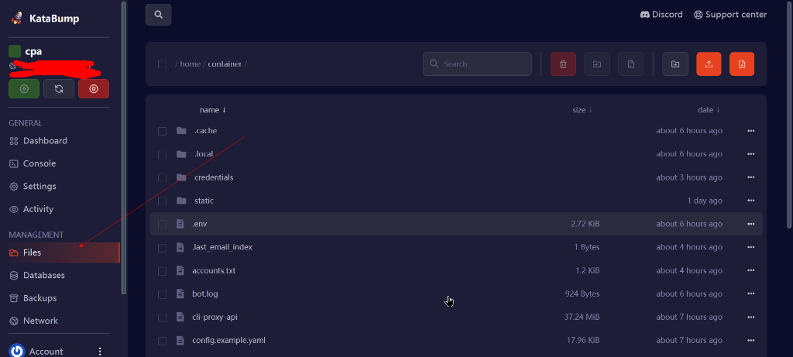
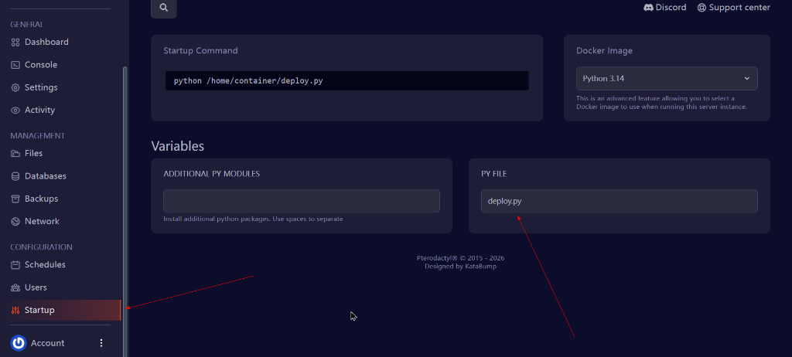
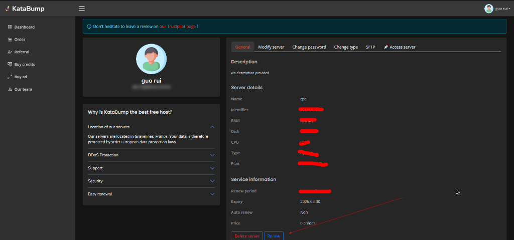

# 🚀 KataBump 专用部署指南 (VPS 一键挂机)

> **核心优势**：针对 KataBump Python 容器深度适配。只需简单的文件拖拽与启动项修改，即可实现 24 小时全自动产号与仓库管理。

---

## 💎 第一步：账号注册与服务器创建

1.  **账号注册**：访问 [KataBump Dashboard](https://dashboard.katabump.com/) 完成注册。
2.  **服务器创建**：
    - 进入 **Order** 菜单。
    - **Type** 务必选择 **Python**。
    - **Resources** 选择 **Free/Gratuit** (通常可以每 4 天免费续期)。
    - 点击下方的 **Create server**。

---

## 💎 第二部分：获取登录凭据

1.  创建成功后，回到 **Dashboard** 列表。
2.  找到你刚才创建的服务器（例：`cpa`），点击右侧的 **See**。
3.  在新页面中，你可以看到该服务器的 **Identifier (登录账号)** 和 **Current password (初始密码)**。
4.  点击最上方的 **Access server** 进入操作控制台：[control.katabump.com](https://control.katabump.com/auth/login)。

---

## 💎 第三部分：上传文件与配置

1.  **上传核心文件**：
    - 在左侧菜单点击 **Files (文件管理)**。
    - 将本地项目内的以下文件直接拖拽上传：
        - `kata_cpa_server.py`
        - `open.py`
        - `deploy.py`
        - `.env` (需先在本地配置好代理与邮箱)

2.  **修改启动配置**：
    - 点击左下角的 **Startup (启动项)**。
    - 找到 **PY FILE (启动文件)** 一栏。
    - 将默认的 `app.py` 修改为 **`deploy.py`**。

---

## 💎 第四部分：启动与监控

1.  **启动服务**：回到左侧菜单点击 **Console (工作台)**。
2.  **执行重启**：点击上方的三个按钮中间的 **Restart (重启)**。
3.  **结果验证**：控制台开始滚动日志，确认系统全量运行。

---

## 💎 第五部分：服务器保活与续期

> **特别注意**：KataBump 的免费服务器有续期周期。为防止服务器被自动删除，请务必关注续期。

1.  **定期续期**：进入服务器管理的 **General** 选项卡。
2.  **手动操作**：如 (图6) 所示，在页面最下方点击 **Renew** 按钮即可完成续期。建议每 2-3 天登录检查一次。

---
