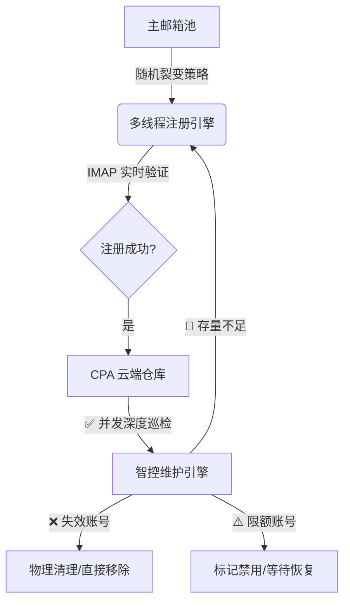

# 🚀 OpenAI 自动注册与 CPA 智控维护系统 (Pro v3.5)

[⬅️ 返回主页](./README.md)

> **工业级、高匿名、全并行管理的 OpenAI 账户自动化产出与运维旗舰方案**

---

## 📑 系统简介
`open.py` v3.5 是一款专为 **大规模账户资产管理** 打造的单文件一体化引擎。它深度整合了 **“多线程裂变注册”** 与 **“并发式 CPA 仓库巡检”**，实现了从账户产出、云端同步到存量清洗的全生命周期无人值守自动化。

## 🏗️ 进化后的系统架构

---

## 🛠️ 核心功能矩阵 (Feature Matrix)

| 模块名称 | 核心能力 | 智控逻辑 (v3.5+) |
| :--- | :--- | :--- |
| **多线程裂变注册** | 支持 Gmail (Plus/Dot/Switch) 与 域名 Catch-all | 并发发起请求，配合 `curl_cffi` 模拟顶级浏览器指纹绕过 WAF。 |
| **并发式巡检引擎** | **[NEW]** 多线程并行测活 (线程池架构) | 同时对多个存量账号发起 `api-call` 深度健康检查，巡检速度提升 10 倍以上。 |
| **激进式清理策略** | **[NEW]** 废弃复活机制，执行物理清理 | 对失效 (401/403) 账号不再浪费时间尝试复活，直接执行物理移除，确保仓库 100% 活号率。 |
| **实时水位感知** | 联锁控制：`Valid < Threshold` -> `Trigger` | 维护引擎实时盘点全球有效活号，一旦低于水位线立即启动异步补货。 |
| **智能环境感知** | 自动识别运行环境切换 UI 或 CLI | 支持 Windows 本地 GUI 调试、VPS 静默挂机、Docker 部署等全场景。 |

---

## ⚙️ 核心参数配置 (.env)

| 变量名 | 推荐设置 | 说明 |
| :--- | :--- | :--- |
| `RUN_MODE` | `0` 或 `1` | **0**: 本地 GUI 模式；**1**: VPS 无头挂机模式。 |
| `THREAD_COUNT` | `2-5` | 补货注册并发数。 |
| `CHECK_INTERVAL_MINUTES` | `60` | 仓库巡检周期，建议每小时巡检一次。 |
| `MIN_ACCOUNTS_THRESHOLD` | `50` | 账号仓库报警水位，低于此值立即补货。 |
| `CPA_UPLOAD_ENABLED` | `1` | 注册成功后是否自动同步到云端 CPA。 |

---

## 🔄 运维逻辑全解析 (Lifecycle)

1.  **并发测活 (Concurrent Check)**：
    利用线程池 (ThreadPoolExecutor) 同时向 CPA 发起高保真业务请求。通过模拟 `/wham/usage` 仪表盘调用，获取账号真实状态。
2.  **物理清理 (Aggressive Cleaning)**：
    检测到账号失效后，系统不再尝试高风险、低成功率的 `refresh_token` 复活。而是**直接执行物理删除**，及时释放仓库槽位，触发健康补货。
3.  **限额隔离 (Rate Limit Guard)**：
    若检测到账号处于 `Overlimit` (周限额满)，系统会自动将其设置为 `Disabled` (禁用)，等待下个周期恢复健康后自动重新启用。
4.  **异步补仓 (Async Replenish)**：
    维护线程计算出有效活号总数后，如果存在缺口，将以**非阻塞方式**启动注册流水线，确保运维与注册两不耽误。

---
